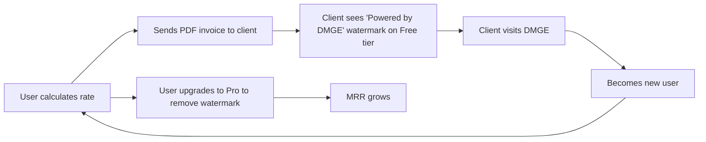

# DMGE RateApp — Full Audit & PWA Marketing Plan

---

## Part 1: App Flow Audit

### 🔐 1. Authentication Flow
| Step | Screen | Notes |
|------|--------|-------|
| 1 | **Login / Register** | Dark-themed pixel-art page. Email + password auth via Supabase. Sign-up creates a profile with `name` + default $25 hourly. |
| 2 | **Loading** | Fullscreen "LOADING..." while session resolves. |
| 3 | **→ Calculator** | Lands on the main calc screen after auth. |

> [!TIP]
> The auth flow is clean and fast. The retro "INSERT QUARTER" copy is memorable. Consider adding OAuth (Google/Apple) for frictionless mobile sign-up — critical for PWA installs.

---

### 🧮 2. Calculator Flow (Core Product)
| Step | Screen | Notes |
|------|--------|-------|
| 1 | **Quick Client Select** | Pre-populates complexity, usage, and client type from saved client. |
| 2 | **Discipline & Role** (collapsible) | Hierarchical: Category → Role → Pricing Model. ~15 categories × multiple roles. Dynamic theme mashup per selection. |
| 3 | **Quantity** (collapsible) | Stepper for units (e.g. "2 per hour"). |
| 4 | **Complexity** (collapsible) | 4-option grid: Simple (0.8x) → Masterpiece (2.0x). |
| 5 | **Client Type** (collapsible) | Individual → Corporate multiplier (1.0x – 2.2x). |
| 6 | **Usage Rights** (collapsible) | Personal → Exclusive (1.0x – 2.5x). |
| 7 | **Revisions** (collapsible) | Stepper. 0 = discount, 3+ = premium. |
| 8 | **Materials / Supplies** (collapsible) | Built-in items per role + custom items. Editable costs, qty +/- chips. |
| 9 | **Travel Expense** (collapsible) | Direct dollar input. |
| 10 | **Rush Delivery** (collapsible) | Yes/No → +30% markup. |
| 11 | **Platform Fee** (collapsible) | Percentage input for payment processor costs. |
| 12 | **★ CALCULATE ★** / **↺ RESET** | Calculates price with all modifiers. |
| 13 | **Results** | Shows **Budget / Fair ★ / Premium** tiers (0.8x, 1.0x, 1.3x). Save to log or save as template. |

> [!NOTE]
> The collapsible design keeps the UI clean despite having 10+ configuration parameters. This is one of the strongest design decisions — progressive disclosure that doesn't overwhelm the user.

---

### 📋 3. Dashboard Flow
| Tab | Description |
|-----|-------------|
| **Jobs** | Links to job history with count badge |
| **Templates** | Links to templates with count |
| **Clients** | Links to client manager with count |
| **Analytics** 🔒 | Gated behind Pro tier |
| **Prof** | Profile / settings page |
| **← Back to Calc** | Returns to the calculator |

---

### 📜 4. Job History Flow
| Feature | Description |
|---------|-------------|
| **Status Summary** | Pending / In Progress / Completed counts |
| **Status Filter** | Dropdown to filter by status |
| **Total Revenue** | Running total of all jobs |
| **Per Job** | Price, role, model, travel, status, date |
| **Actions per Job** | Edit ✏️, Delete 🗑️, PDF, Email, + Template, + Client |
| **Invoice Row** | Invoice number, due date, paid/overdue indicator |
| **Status Updates** | Pending → Sent/IP → Paid/Done buttons |
| **CSV Export** 🔒 | Gated behind Pro tier |

---

### 📧 5. Email/Quote Flow
| Step | Description |
|------|-------------|
| 1 | Opens modal with pre-filled subject & body from job data |
| 2 | User enters recipient email |
| 3 | Opens native `mailto:` link with encoded subject/body |

---

### 📄 6. PDF Invoice Flow
| Feature | Description |
|---------|-------------|
| Sequential invoice numbering (INV-1000, 1001...) | Auto-assigned |
| Company branding in PDF | Name, logo URL, address, payment instructions |
| Due date tracking | Net 14 default, overdue highlighting |
| Gated | Free tier: 1 PDF/day |

---

### 👤 7. Profile Flow
| Section | Contents |
|---------|----------|
| **Player Info** | Name, default hourly, logout |
| **Subscription** | Current plan badge, usage stats (clients, templates, PDFs, history days), upgrade CTA |
| **Invoice Settings** | Prefix, start number, next invoice preview |
| **Company Branding** | Company name, email, phone, address, logo URL, payment instructions, terms, tax ID |

---

### 💰 8. Pricing / Monetization Flow
| Tier | Price | Key Features |
|------|-------|-------------|
| **Free** | $0 | 5 clients, 5 templates, 30-day history, 1 PDF/day |
| **Pro** | $9/mo | Unlimited everything, analytics, CSV export |
| **Agency** | $29/mo | Pro + white-label branding, logo upload, priority support |

Stripe checkout integration via Supabase Edge Functions. Gating implemented on: clients, templates, analytics, CSV, PDF exports.

---

### 🎓 9. Tutorial Flow
6-step interactive tutorial modal covering:
1. Theme mashups per discipline/role
2. Base pay slider (Power Level)
3. Complexity & usage multipliers (Buffs & Debuffs)
4. Materials & supplies
5. Saving jobs & templates
6. PDF export & email delivery

---

## Part 2: App Rating (1–10)

### Functionality: **8 / 10**

| Strength | Details |
|----------|---------|
| ✅ Complete pricing engine | 10+ parameters with multiplicative modifiers |
| ✅ Full CRUD lifecycle | Jobs, clients, templates — all cloud-synced |
| ✅ PDF invoicing | Professional, branded invoices with sequential numbering |
| ✅ Email integration | Pre-filled mailto with invoice details |
| ✅ Analytics (Pro) | Revenue charts, category breakdowns, date-range filtering |
| ✅ Tiered monetization | Well-structured freemium gating |

| Gap | Impact |
|-----|--------|
| ⚠️ No payment link in invoices | Can't collect payments directly |
| ⚠️ Email uses `mailto:` | Not a proper email API — depends on user's email client |
| ⚠️ No recurring invoices | Manual re-creation needed |

---

### Ease of Use: **7.5 / 10**

| Strength | Details |
|----------|---------|
| ✅ Collapsible sections | Progressive disclosure prevents overwhelm |
| ✅ Tutorial system | 6-step onboarding inside the app |
| ✅ Dynamic themes | Visual feedback for category/role changes keeps it engaging |
| ✅ Template re-use | One-click loads from saved templates |
| ✅ Quick Client Select | Pre-fills preferences instantly |

| Gap | Impact |
|-----|--------|
| ⚠️ All CSS-in-JS styles | Hard to override for accessibility needs |
| ⚠️ No undo on delete | Jobs and clients deleted immediately |
| ⚠️ Dense job history cards | Many buttons per job card on mobile |

---

### Selling Point: **9 / 10**

| Factor | Why It Scores High |
|--------|-------------------|
| 🎮 **Visual identity** | The 8-bit arcade aesthetic is instantly recognizable and memorable. No other rate calculator looks like this. |
| 🎨 **Dynamic theming** | 60+ unique color mashups per category/role/model combo create a deeply personalized feel. |
| 💰 **Smart pricing engine** | Doesn't just multiply hours × rate — it factors complexity, usage rights, client type, rush, travel, materials, platform fees, and client-specific multipliers. |
| 🏷️ **Niche clarity** | Built specifically for freelancers/creatives who need to justify their rates — not a generic invoicing tool. |
| 📊 **Full business lifecycle** | Quote → Save → Invoice → Email → Track → Analyze. One tool, end-to-end. |

> [!IMPORTANT]
> **The #1 selling point is the intersection of personality + precision.** Most rate calculators are sterile spreadsheets. DMGE turns pricing into an experience. This is the exact kind of "tool with a vibe" that spreads on social media.

---

### Overall Composite Score: **8.2 / 10**

---

## Part 3: PWA Conversion & Marketing Strategy

### Step 1: Convert to PWA (Technical)

The app is already a Vite + React SPA — converting to a PWA is straightforward.

#### Files Needed:

| File | Purpose |
|------|---------|
| `public/manifest.json` | App name, icons, theme color, display mode |
| `public/sw.js` or vite-plugin-pwa | Service worker for offline caching |
| `public/icon-192.png` + `icon-512.png` | App icons for install prompt |
| Updated `index.html` | Link manifest, add meta tags for iOS |

#### Key Manifest Config:
```json
{
  "name": "DMGE — Freelance Rate Calculator",
  "short_name": "DMGE",
  "description": "The 8-bit business OS for freelancers and creatives",
  "start_url": "/",
  "display": "standalone",
  "background_color": "#2a2a2a",
  "theme_color": "#FFD700",
  "icons": [
    { "src": "/icon-192.png", "sizes": "192x192", "type": "image/png" },
    { "src": "/icon-512.png", "sizes": "512x512", "type": "image/png" }
  ]
}
```

#### Recommended Plugin:
```bash
npm install -D vite-plugin-pwa
```
This auto-generates the service worker with Workbox and handles caching strategies.

---

### Step 2: Deploy

| Platform | Why |
|----------|-----|
| **Vercel** (recommended) | Free tier, instant deploys from GitHub, auto-HTTPS (required for PWA), edge caching |
| Netlify | Alternative, same benefits |
| Cloudflare Pages | Best performance, free tier |

> [!IMPORTANT]
> PWAs **require HTTPS** to register a service worker. All three platforms provide this automatically. Do NOT deploy to raw GitHub Pages without a custom domain + SSL.

---

### Step 3: Marketing Strategy

#### 🎯 Target Audience
- **Primary**: Freelance creatives (photographers, illustrators, designers, writers, videographers)
- **Secondary**: Small agencies and creative studios
- **Tertiary**: Gig workers in any discipline (legal, consulting, education)

#### 📱 PWA-Specific Marketing Angles

| Angle | Message |
|-------|---------|
| **No App Store needed** | "Add to Home Screen in 2 taps. No downloads, no updates, no 30% Apple tax." |
| **Works offline** | "Quote clients at a coffee shop with no WiFi." |
| **Cross-platform** | "Same app on iPhone, Android, laptop, tablet." |
| **Instant updates** | "Always the latest version. Zero friction." |

#### 🚀 Launch Channels

| Channel | Tactic | Expected Impact |
|---------|--------|----------------|
| **TikTok / Reels** | Screen recording of theming + pricing in action. The visual identity is *made* for short-form video. "I built an 8-bit rate calculator for freelancers" | 🔥🔥🔥 High virality potential |
| **Twitter/X** | Thread: "I stopped underselling my freelance work. Here's the tool I built." | 🔥🔥 Community engagement |
| **Reddit** | Post in r/freelance, r/design, r/photography, r/webdev, r/IndieHackers | 🔥🔥 Targeted signups |
| **Product Hunt** | Launch with pixel-art branding assets. The aesthetic will stand out. | 🔥🔥🔥 Day-one surge |
| **Creative community discords** | Share in design/illustration/photo communities | 🔥 Organic word-of-mouth |

#### 💡 Content Marketing Ideas

1. **"Are You Undercharging?"** — Interactive blog post that links to the calculator
2. **Rate comparison data** — "What 500 photographers charge per hour" (aggregate from anonymous app data later)
3. **Freelance pricing guide** — SEO play targeting "how much to charge for [photography/illustration/etc]"
4. **Client negotiation scripts** — "Use your DMGE quote to negotiate" — positions the app as a confidence tool

#### 🏷️ Taglines to Test

| Tagline | Vibe |
|---------|------|
| "Know your worth. In pixels." | Clean, compelling |
| "The 8-bit business OS for creatives." | Establishes category |
| "Stop guessing. Start quoting." | Problem → solution |
| "Level up your rates." | Gamified language, fits theme |
| "DMGE: Damage your competitors, not your rates." | Aggressive, memorable |

---

### Step 4: Growth Loop (Post-Launch)



> [!TIP]
> The **Free tier PDF watermark** is your single best viral growth mechanism. Every invoice sent is a marketing touchpoint. Keep the Free tier generous enough that users actually send invoices, but make Pro compelling enough to upgrade.

---

## Open Questions for You

1. **Domain name** — Do you have a domain? (e.g. `dmge.app`, `getdmge.com`)
2. **App icons** — Shall I generate pixel-art PWA icons (192×192 + 512×512) matching the DMGE aesthetic?
3. **Deployment** — Do you want to deploy via Vercel, Netlify, or somewhere else?
4. **PWA implementation** — Want me to proceed with the full PWA conversion (manifest, service worker, meta tags)?
5. **Landing page** — Do you want a marketing landing page separate from the app, or should the auth screen double as the landing page?
